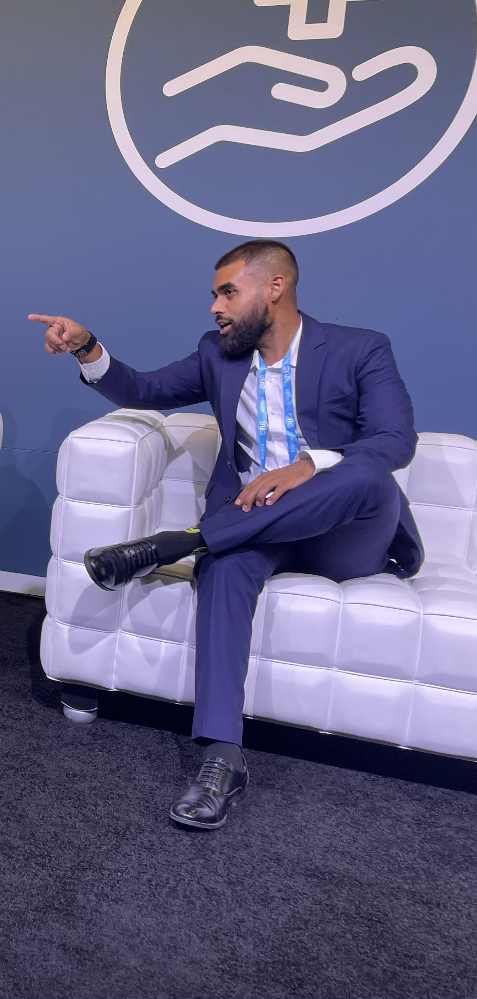

# About-Fahim-website
<!DOCTYPE html>
<html lang="en">
<head>
    <meta charset="UTF-8">
    <meta name="viewport" content="width=device-width, initial-scale=1.0">
    <title>Meet Fahim</title>
</head> <h1>Fahim Haque </h1>

<h2>Langues parlées</h2>
<h4>Français, anglais, arabe, espagnol, bengali </h3>

<body>
<h3>Expérience professionnelle</h3>

<h4>Conseiller en Développement Philanthropique</h4>

Centraide du Grand Montréal (2021-Présent)

<ul>
    <li>Orchestration et amélioration des campagnes annuelles de collecte de fonds, en
collaboration étroite avec les équipes des Grands Donateurs et les partenaires nationaux.</li>
    <li>Identification et sécurisation de nouvelles sources de financement, contribuant de manière
significative à l’expansion des initiatives de Centraide.</li>
    <li>Coordination des relations avec les Centraide du Québec et les United Way du Canada pour
assurer la cohérence des efforts de collecte de fonds à l’échelle nationale.</li>
    <li>Collaboration avec des équipes internes pour optimiser les processus de travail et renforcer
les relations avec les parties prenantes.</li>

</ul>

 
<h4>Directeur et Co-Fondateur</h4>

Pour le Hood (2014-2024)

<ul>
    <li>Fondation de l’association dédiée à l’amélioration des conditions de vie des populations
marginalisées à Montréal.</li>
    <li>Développement et mise en œuvre de stratégies de levée de fonds, réussissant à mobiliser
des ressources importantes pour soutenir les initiatives sociales de l’association.</li>
    <li>Supervision de la collaboration avec plus de 100 partenaires locaux, assurant la pérennité et
l’impact durable de la mission de l’association.</li>
    <li>Gestion d’une équipe de 20 bénévoles à temps partiel et de 50 bénévoles récurrents, en
coordination avec diverses parties prenantes.</li>
</ul>
 

<h4>Chargé de Projet</h4>

Institut du Nouveau Monde (2019
–2021)

<ul>
    <li>Animation d’activités de consultation publique et coordination d’équipes pour la réalisation de
projets de collecte de rêves à travers le Québec.</li>
    <li>Préparation de rapports et de comptes-rendus pour assurer la transparence et l’efficacité des
interventions.</li>    
    <li>Entretien de relations partenariales avec divers acteurs pour garantir le succès des projets.</li>
</ul>

<h4>Collaborateur en Intercommunalité</h4>

Programme des Nations Unies pour le Développement — Tunis, Tunisie
(2019)

<ul>
    <li>Organisation de réunions, ateliers et missions pour trois municipalités en Tunisie, facilitant la
collaboration entre experts techniques, maires, partenaires et bailleurs de fonds.</li>
    <li>Coordination des activités liées aux projets de développement local, assurant le respect des
objectifs et des délais.</li>
</ul>

<h4>Agent de Communications Stratégiques et Sécurité Numérique</h4>

Forum Tunisien des Droits Économiques et Sociaux (FTDES) — Tunis, Tunisie
(2018–2019)

<ul>
    <li>Gestion des données sur la migration et coordination de forums régionaux pour la protection
de l’environnement.</li>
    <li>Mise en place de stratégies de communication pour promouvoir la mission et les projets de
l’organisation.</li>
</ul>

<h4>Agent de Recherche et Développement</h4>

Commission des Droits de la Personne et des Droits de la Jeunesse (2018)

<ul>
    <li>Analyse des recommandations de la Commission et recherche pour la rédaction de rapports
sur la protection de la jeunesse.</li>
    <li>Conduite d’entretiens avec des acteurs clés pour élaborer des recommandations pertinentes.
</li>
</ul>

<h4>Directeur de Boutique e-Commerce</h4>

Comfortends (2015-2021)

<ul>
    <li>Création et gestion d’un site de vente en ligne, incluant la coordination des commandes, la
communication avec les clients, et le marketing sur les réseaux sociaux.</li>
    <li>Développement de partenariats avec des fournisseurs internationaux pour optimiser l’offre et
la logistique.</li>
</ul>

<h3>Éducation</h3>

<h4>Maîtrise en Affaires Publiques et Internationales Université de Montréal (2017–2018)</h4>
<h4>Baccalauréat en Sciences Politiques et Philosophie Université de Montréal
(2014-2016)</h4>
<h4>Diplôme d’Études Collégiales Collège Jean-de-Brébeuf (2011–2013)</h4>

<h3>Bénévolat</h3>
<ul>
    <li>Accueil Bonneau — 2007-2009</li>
    <li>Portes Ouvertes au Collège Jean-de-Brébeuf — 2008-2012</li>
    <li>Sun Youth Organization — 2008-2012</li>
    <li>Défi Sportif pour Athlètes à Mobilité Réduite — 2012</li>
    <li>Mission Bon Accueil — 2013</li>
    <li>Moisson Montréal — 2013-2014</li>
    <li>Manoir Ronald McDonald — 2013-2014</li>
</ul>

<h3><a href="./contact.html">Écrivez-moi!</a></h3>

 
    <footer>
    
© Fahim Haque. All rights reserved.

    </footer>
</body>
</html>
